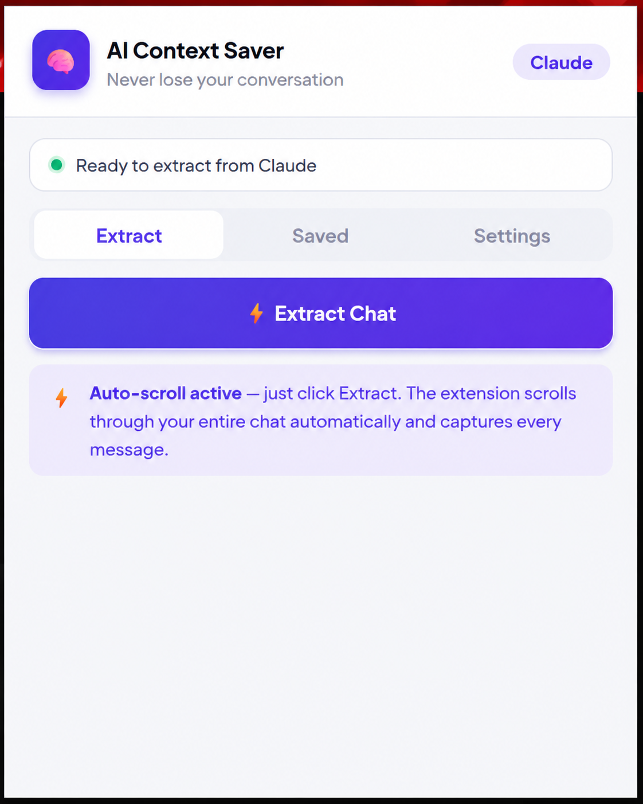
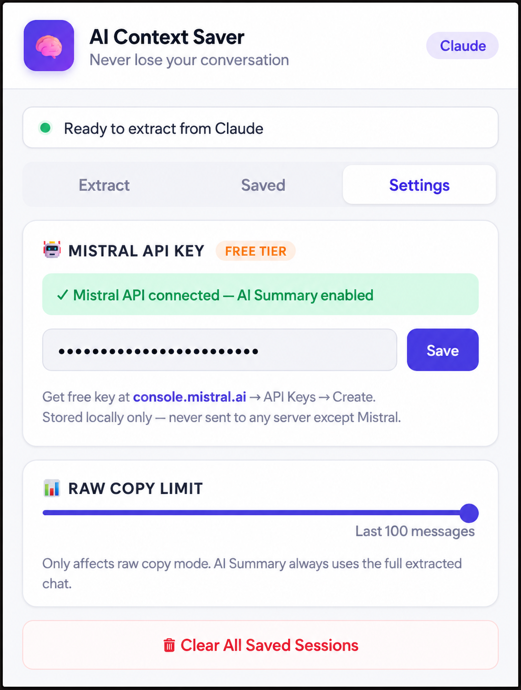
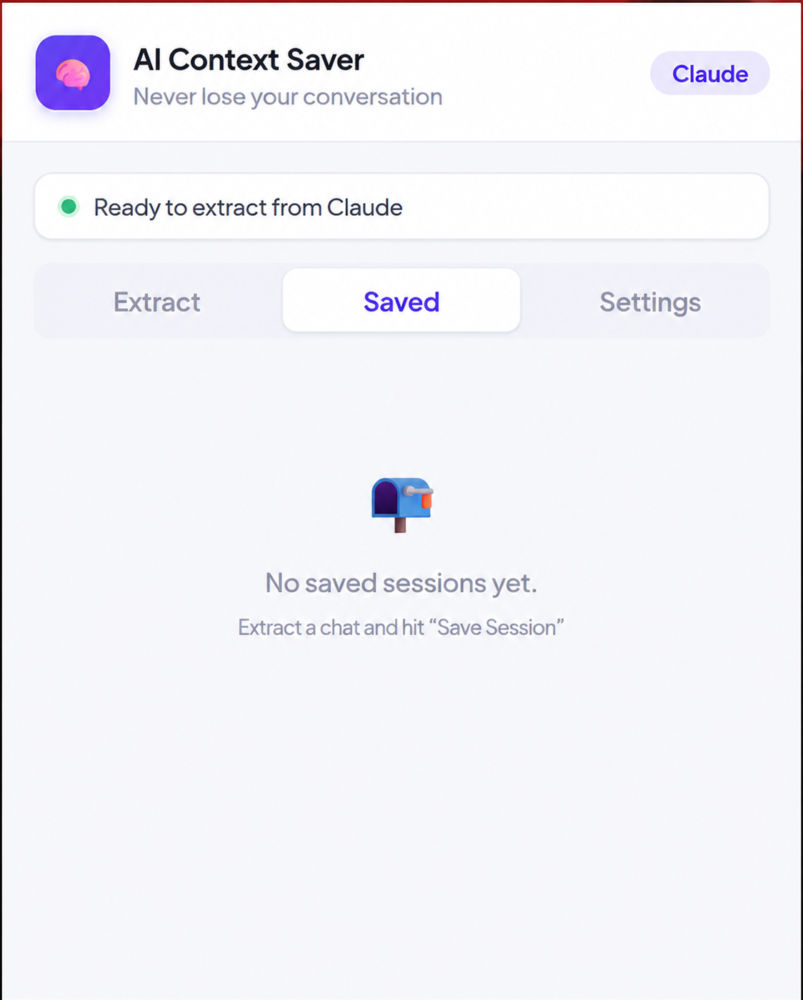

# 🧠 AI Context Saver Pro

**Never lose your AI conversation again.** A Chrome extension that captures your full chat history from any AI platform, then uses Mistral AI to compress it into a smart summary — so you can continue in a new session with almost zero context used.

[](https://github.com/maazzalii/context-saver-extension)
[](https://developer.chrome.com/docs/extensions/mv3/)
[](https://mistral.ai)
[](https://console.mistral.ai)
[](LICENSE)

> 🔗 **No API key?** Use the free version without any setup: [ai-context-saver](https://github.com/maazzalii/context-saver-extension)

---

## The Problem

Anyone using AI tools seriously for coding, writing, or research hits this wall:

> *"Your conversation is getting long. The model may start losing context soon."*

You open a new chat and paste your old conversation — but now you've used up half the new session's context just on the paste. You hit the limit again, just a bit later. **You're solving the problem with the same problem.**

On top of that, modern AI platforms like Claude and ChatGPT use **virtual DOM scrolling** — old messages are literally deleted from the browser's memory as you scroll down. By the time you try to copy your chat, the first 60% of it doesn't even exist in the page anymore.

---

## ✅ The Solution

**Context Saver Extension** solves both problems:

1. **Auto-scroll extraction** — the extension takes control of the page, scrolls up through your entire chat step by step, captures every single message as it loads into the DOM, then scrolls back down. No manual scrolling needed.

2. **Mistral AI summarization** — instead of pasting a 10,000-word raw chat, the extension sends it to the free Mistral API and gets back a smart 300–800 word briefing. You paste *that* instead. Your new session starts with almost no context used.

**The result:** A 50-message chat that would eat 8,000 tokens becomes a 400-token summary. That's a **95% reduction** in context usage.

---

## ✨ Features

| Feature | Description |
|---|---|
| ⚡ **One-click extraction** | Auto-scrolls your chat and captures every message |
| 🤖 **AI Smart Summary** | Mistral AI compresses full chat to ~400 words |
| 📋 **Raw Copy fallback** | Copy full conversation without any API |
| 💾 **Save sessions** | Store up to 20 sessions locally, re-copy anytime |
| 🔒 **100% local storage** | API key and sessions never leave your device |
| 🌐 **5 platforms** | Claude, ChatGPT, Gemini, Copilot, Perplexity |
| 🧹 **Smart filtering** | Automatically removes previously pasted summaries from extraction |
| 📊 **Live progress** | Real-time message count updates while scrolling |

---

## 🖥️ Screenshots

| Extract Tab | Settings Tab | Saved Sessions |
|---|---|---|
|  |  |  |

---

## 🚀 Installation

### Step 1 — Get a Free Mistral API Key *(optional but recommended)*
1. Go to [console.mistral.ai](https://console.mistral.ai)
2. Sign up — no credit card needed for the free tier
3. Navigate to **API Keys → Create new key**
4. Copy the key — you'll paste it into the extension settings

### Step 2 — Download
```bash
git clone https://github.com/maazzalii/context-saver-extension.git
```
Or download the ZIP from the [Releases](https://github.com/maazzalii/context-saver-extension/releases) page and unzip it.

### Step 3 — Load in Chrome
1. Open Chrome and go to `chrome://extensions/`
2. Toggle **Developer mode** ON (top-right switch)
3. Click **"Load unpacked"**
4. Select the `ai-context-saver-pro` folder

### Step 4 — Add Your API Key
1. Click the 🧠 extension icon in your toolbar
2. Go to the **Settings** tab
3. Paste your Mistral API key → click **Save**
4. Status turns green: *✓ Mistral API connected*

---

## 📖 How to Use

### With AI Summary *(recommended)*
1. Open any AI chat that's getting long
2. Click the **🧠 extension icon** in your Chrome toolbar
3. Click **⚡ Extract Chat** — the extension auto-scrolls your entire chat
4. Wait ~10–20 seconds for scrolling to complete
5. Click **🤖 AI Smart Summary (Mistral)**
6. Wait ~3 seconds for Mistral to generate the summary
7. Click **📋 Copy** next to the summary
8. Open a new AI chat → **paste** → you're back in business

### Without API Key *(raw copy)*
1. Follow steps 1–4 above
2. Click **📋 Copy Raw** instead
3. Paste the full conversation into your new session

---

## 💰 Is the Mistral Free Tier Really Free?

Yes — completely. The free "Experiment" plan includes:

| Limit | Value |
|---|---|
| **Tokens per month** | 1,000,000,000 (1 billion) |
| **Requests per minute** | ~30 |
| **Monthly cost** | **$0** |

Each summary call uses roughly 2,000–4,000 tokens depending on chat length. At 1 billion tokens/month, you could summarize **250,000+ conversations** for free. You will never realistically hit this limit.

---

## 🌐 Supported Platforms

| Platform | URL | Support Level |
|---|---|---|
| **Claude** | claude.ai | ✅ Full — auto-scroll + extraction |
| **ChatGPT** | chatgpt.com | ✅ Full — auto-scroll + extraction |
| **Google Gemini** | gemini.google.com | ✅ Full — auto-scroll + extraction |
| **Microsoft Copilot** | copilot.microsoft.com | ✅ Full — auto-scroll + extraction |
| **Perplexity AI** | perplexity.ai | ✅ Full — auto-scroll + extraction |

---

## 🧠 How the AI Summary Works

When you click **AI Smart Summary**, the extension:

1. Takes all captured messages (the full cleaned chat)
2. Sends them to `mistral-small-latest` with a specialized system prompt
3. Mistral reads the entire conversation and extracts:
   - The main topic and goal
   - All key decisions and conclusions reached
   - Any important code, files, or data discussed
   - Current progress and state of work
   - Exactly what to do next (the "CONTINUE FROM" line)
4. Returns a structured 300–800 word briefing (scales to conversation length)
5. Wraps it in a ready-to-paste continuation prompt

The summary always ends with **"CONTINUE FROM: [one sentence of exactly what to do next]"** so the new AI session knows precisely where to pick up.

---

## 🔧 How Auto-Scroll Works

AI platforms use **virtual DOM rendering** — messages that scroll out of view are deleted from the browser's memory to save performance. This is why simple copy-paste tools only capture 40–80 messages.

Our auto-scroll collector works in 3 phases:

**Phase 1** — Jumps to the bottom of the chat, captures all currently visible messages.

**Phase 2** — Scrolls upward in steps (500px at a time), pausing at each step to let the DOM render newly loaded messages. Collects new messages at every stop. Continues until the top is reached or no new messages appear for 6 consecutive steps.

**Phase 3** — Scrolls back to the bottom, captures any final messages, then sorts everything by its original page position to preserve correct order.

A live progress overlay appears on the page showing you exactly how many messages have been captured and how far through the scroll process the extension is.

---

## 🗂️ Project Structure

```
ai-context-saver-pro/
├── manifest.json       ← Chrome Extension config (Manifest V3)
├── content.js          ← Auto-scroll collector + DOM message scraper
├── background.js       ← Service worker (relays live progress to popup)
├── popup.html          ← Extension UI
├── popup.js            ← All popup logic + Mistral API calls
├── icons/
│   ├── icon16.png
│   ├── icon48.png
│   └── icon128.png
└── README.md
```

---

## 🛠️ Tech Stack

| Technology | Used For |
|---|---|
| **JavaScript (ES6+)** | All extension logic |
| **Chrome Extension APIs (MV3)** | Tab access, scripting, storage |
| **Chrome Storage API** | Local session and key storage |
| **Content Scripts** | DOM access and page scrolling |
| **Background Service Worker** | Progress relay between content and popup |
| **Mistral AI API** | Intelligent conversation summarization |
| **HTML/CSS** | Popup UI |

---

## ⚠️ Troubleshooting

| Problem | Solution |
|---|---|
| **0 messages extracted** | Make sure you're on a supported AI platform page with an active chat |
| **Stuck at low % during scroll** | The chat container may use a non-standard scroll method — try refreshing the page and extracting again |
| **API key invalid error** | Re-copy from console.mistral.ai — make sure there are no spaces |
| **429 Too Many Requests** | Wait 1 minute (free tier: 30 requests/minute limit) |
| **Summary includes pasted context** | This is filtered automatically — if it still appears, re-extract after refreshing |
| **Extension not responding** | Go to chrome://extensions/ → Context Saver Extension → click the refresh icon |

---

## 🔒 Privacy

- Your Mistral API key is stored **only in Chrome's local storage** on your device
- Chat content is sent to Mistral AI's API for summarization — subject to [Mistral's privacy policy](https://mistral.ai/privacy/)
- Nothing is stored on any server we control
- No analytics, no telemetry, no tracking of any kind

---


## 🗺️ Roadmap

- [ ] Firefox support
- [ ] Keyboard shortcut to trigger extraction
- [ ] Export sessions to `.txt` / `.md` file
- [ ] Custom summary templates
- [ ] Support for more AI platforms

---

## 🤝 Contributing

Pull requests are welcome. For major changes, open an issue first to discuss what you'd like to change.

1. Fork the repo
2. Create your feature branch: `git checkout -b feature/my-feature`
3. Commit your changes: `git commit -m 'Add my feature'`
4. Push to the branch: `git push origin feature/my-feature`
5. Open a Pull Request

---

## 📄 License

[MIT](LICENSE) — free to use, modify, and distribute.

---

## 👨‍💻 Built By

**Maaz Ali** — CS student at NUML, Pakistan. Building in public, solving real problems.

- 🔗 [LinkedIn](https://linkedin.com/in/maazzalii)
- 💻 [GitHub](https://github.com/maazzalii)

If this extension saved you from context-limit hell, a ⭐ on the repo goes a long way — it helps other developers find it.

---

*Built because I hit this problem myself and couldn't find a proper solution.*
